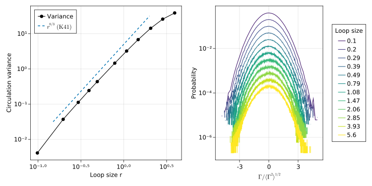

# Circulation.jl

Computation of velocity circulation statistics from Navier-Stokes (NS) and
Gross-Pitaevskii (GP) data.

## Contents

- [System requirements](#system-requirements)
- [Installation](#installation)
- [Running the examples](#running-the-examples)
- [Output files](#output-files)
- [References](#references)

## System requirements

This software is known to work on Linux systems.
In particular, it has run on Fedora 34, Ubuntu 21.04, and RHEL 8.
It will likely also work on other operating systems.

The software requires Julia 1.6 or above.
See below for installation details.
We take advantage of a number of Julia packages, in particular [FFTW.jl](https://github.com/JuliaMath/FFTW.jl) and [HDF5.jl](https://github.com/JuliaIO/HDF5.jl), which wrap the corresponding C libraries.
The full list of dependencies is listed in the different `Project.toml` files, while the actual version numbers that have been known to work are detailed in `Manifest.toml`.
As illustrated further below, the Julia package manager allows to easily install the very same versions of the packages listed in the manifest files.

This software runs on standard CPUs.
It is possible to take advantage of the availability of multiple shared-memory CPUs for thread-based parallelisation.

## Installation

To use this software, it is necessary to install Julia and the Julia packages needed for the software to run.
Luckily, this is very easy to do thanks to Julia's built-in package manager.
The installation should typically take less than 15 minutes on a normal desktop computer.

### 1. Installing Julia

Julia may be installed by downloading the binaries at the [Julia website](https://julialang.org/downloads/).
Please see that link for more details.

### 2. Installing dependencies

Once Julia has been installed, run the following from the root directory of this project to install the dependencies:

```bash
julia --project -e "using Pkg; Pkg.instantiate()"
```

## Running the examples

### 1. Analysing velocity fields (e.g. from NS simulations)

#### Generating sample data

In this example, we compute circulation statistics on a synthetic velocity field generated using the [`scripts/synthetic.jl`](scripts/synthetic.jl) script.
Note that the script requires an extra set of dependencies, specified in [`scripts/Project.toml`](scripts/Project.toml).
To automatically install them, first run

```bash
julia --project=scripts -e "using Pkg; Pkg.instantiate()"
```

Note that this will install the packages listed in the `Project.toml` and `Manifest.toml` in the [`scripts/`](scripts/) subdirectory.

Then, run the script as follows:

```bash
julia --project=scripts scripts/synthetic.jl
```

This will in particular generate binary files `VI{x,y,z}_d.000.dat` on the root directory, containing the three components of the synthetic velocity field.
Also note that the field can be visualised by opening the generated `synthetic.vti` file in [ParaView](https://www.paraview.org/).
To analyse the fields, first move them to `sample_data/NS/`:

```bash
mv -v VI*_d.000.dat sample_data/NS/
```

#### Computing circulation statistics

To analyse the data, run the [`examples/circulation_NS.jl`](examples/circulation_NS.jl) script as follows, from the root directory of this project:

```bash
export JULIA_NUM_THREADS=4  # optional, to use threads
julia --project examples/circulation_NS.jl
```

Note that the script is fully commented and may be easily modified.

This will generate a `circulation_NS.h5` file containing the circulation statistics of the field.
See [Output files](#output-files) below for the typical structure of these files.

#### Plotting the generated data

The generated data may be plotted using the [`examples/plots/circulation.jl`](examples/plots/circulation.jl) script.
That script provides an example of how to access the generated HDF5 files from Julia.

Similarly to above, here we require an extra set of dependencies, in particular [Makie.jl](https://makie.juliaplots.org/) for the plots.
As before, these dependencies can be installed by running:

```bash
julia --project=examples/plots -e "using Pkg; Pkg.instantiate()"
```

Then, the results may be plotted by running

```bash
julia --project=examples/plots examples/plots/circulation.jl
```

Note that these operations may take a while due to Julia's [time to first plot](https://discourse.julialang.org/t/time-to-first-plot-clarification/58534) problem (but things are quickly improving!).

The script will generate a `circulation_NS.svg` file with the figure, which should look like the following:



### 2. Analysing GP (quantum turbulence) data

First, download the sample data available from [Zenodo](https://doi.org/10.5281/zenodo.5510350), and put the `ReaPsi.001.dat` and `ImaPsi.001.dat` under `sample_data/GP/`.
These two files are raw binary files containing the real and imaginary parts of a three-dimensional complex wave number field.
This field is an instantaneous numerical solution of the generalised Gross-Pitaevskii (GP) equations at a resolution of 256³ collocation points.

To analyse the data, run the [`examples/circulation_GP.jl`](examples/circulation_GP.jl) script as follows, from the root directory of this project:

```bash
export JULIA_NUM_THREADS=4  # optional, to use threads
julia --project examples/circulation_GP.jl
```

Note that the script is fully commented and may be easily modified.

This will generate a `circulation_GP.h5` file containing the circulation statistics of the field.
See [Output files](#output-files) below for the typical structure of these files.

## Output files

Histograms and moments are written to a binary HDF5 file.
The path to the output file is specified in the parameter file.
A single HDF5 file may contain circulation statistics for the velocity, the
regularised velocity (GP only) and momentum (GP only).
HDF5 files are easy to read in different languages.

HDF5 files have a filesystem-like structure, where each "directory" is called
a *group*.
The structure of the output HDF5 files looks something like the following:

```bash
# Simulation parameters
/ParamsGP                       Group
    /L                          Dataset {3}
    /c                          Dataset {SCALAR}
    /dims                       Dataset {3}
    /kappa                      Dataset {SCALAR}
    /nxi                        Dataset {SCALAR}
    /xi                         Dataset {SCALAR}

# Circulation statistics
/Circulation                    Group
    /Velocity                   Group
        /kernel_area            Dataset {16}      # area of convolution kernels
        /kernel_lengths         Dataset {16, 2}   # size (rx, ry) of rectangular kernels
        /kernel_shape           Dataset {SCALAR}  # e.g. "RectangularKernel"
        /kernel_size            Dataset {16}      # linear size of convolution kernels
        /resampled_grid         Dataset {SCALAR}  # boolean; true if circulation was computed in resampled grid
        /resampling_factor      Dataset {SCALAR}  # integer

        /Histogram              Group
            /bin_edges          Dataset {4000}
            /hist               Dataset {51, 3999}
            /maximum            Dataset {16}
            /minimum            Dataset {16}
            /total_samples      Dataset {51}

        /Moments                Group
            /M_abs              Dataset {16, 10}  # moments ⟨ |Γ|^p ⟩
            /M_odd              Dataset {16, 5}   # moments ⟨ Γ^p ⟩ for p odd
            /p_abs              Dataset {20}      # values of p associated to M_abs
            /p_odd              Dataset {10}      # values of p associated to M_odd
            /total_samples      Dataset {51}
```

(You can use the command-line utility `h5ls` to see the file structure.)

## References

If you use this software, please cite the following works, where different versions of the software were used.

-  N. P. Müller, J. I. Polanco and G. Krstulovic,
  *Intermittency of Velocity Circulation in Quantum Turbulence*,
  [Phys. Rev. X **11**,
 011053 (2021)](https://doi.org/10.1103/PhysRevX.11.011053).

 - J. I. Polanco, N. P. Müller and G. Krstulovic,
   *Vortex clustering, polarisation and circulation intermittency in classical and quantum turbulence*,
   [arXiv:2107.03335 [physics.flu-dyn] (2021)](https://arxiv.org/abs/2107.03335).
